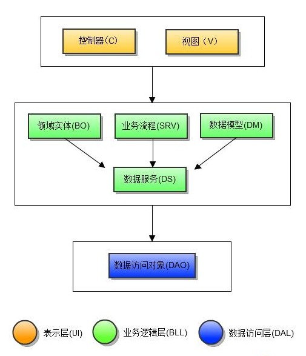

分层体系与类命名
==============
软件分层 
-------
意为将软件系统按照一定职责范围划分为多个层次，每一层都依托在其下层之上，上层使用了下层定义的各种服务，而下层对上层一无所知。另外，每一层对自己的上层隐藏其下层的细节。    

将系统按照层次分解有很多重要的好处:   

	在无需过多了解其他层次的基础上，可以将某一层作为一个有机整体来理解。
    可以替换某层的具体实现，只要前后提供的服务相同即可。
    可以将层次间的依赖性减到最低。
    分层有利于标准化工作。
    一旦构建好了某一层次，就可以用它为很多上层服务提供支持。

分层是一种重要的技术，但也有缺陷：   

	层次并不能封装所有东西。有时它会为我们带来级联修改。
    过多的层次会影响性能。

三层架构
-------
比较推崇的分层架构（又称“三层架构”）   

    表现层：向用户显示信息并把从用户那里获取的信息解释成领域层或数据层上的各种动作。
    业务逻辑层：是系统架构中体现核心价值的部分。
			  它的关注点主要集中在业务规则的制定、业务流程的实现等与业务需求有关的系统设计，
              也即是说它是与系统所应对的领域（Domain）逻辑有关，很多时候，也将业务逻辑层称为领域层。
    数据访问层：有时候也称为是持久层，其功能主要是负责数据库的访问，可以访问数据库系统、二进制文件、文本文档或是XML文档。

MVC模式
-------
MVC架构是"Model-View-Controller"的缩写，中文翻译为"模型-视图-控制器"。
MVC模型是SBPHP提供的最核心功能之一，SBPHP就是依据其架构思想进行设计的，其职责划分为：

    M 即Model(模型层)，主要负责业务逻辑以及数据处理
    V 即View(视图层)，主要用于显示数据和提交数据
    C 即Controller(控制器)，主要是捕获请求，控制请求转发，协调M和C进行正常工作  

业务分层
-------
SBPHP的分层主要是在MVC的基础上，借鉴软件分层的思想，对M进行更深入的业务分层，最终形式为：

代码分类与命名
------------

因为SBPHP是使用面对对象的程序设计，所以程序代码是以类的形式出现，根据其业务分层和功能职责，大致可分类一下几类：

1. Dao（Data Access Objects，数据访问对象）   
    * 职责范围：负责与数据库某一张表的通信。原则上是一个对象管理一张表，特殊情况下，可能一个对象管理多张表的关联
    * 命名规范：通常是****Dao，比如PwUserDao，PwThreadDao等    
2. DS（Data Service，数据服务）   
    * 职责范围：软件的原子业务逻辑单元（最小业务单元），他通常对应的是业务数据，而不是依赖于Dao的数据表结构设计。
    * 命名规范：不带任何后缀(通常以模块命名，所以是一般是名词)，比如PwUser,PwForum等    
3. DM（Data Model，数据模型）   
    * 职责范围：是存储的数据和业务对象之间的一个映射关系。   
    * 命名规范：通常是****Dm，比如PwUserInfoDm，PwThreadDm    
4. Bo（Business Objects，领域实体/业务对象）   
    * 职责范围：领域实体是某个领域内各种对象的抽象，它构成了整个业务逻辑的骨骼和静态模型。例如，银行业领域内有账户、支票、前台营业员等实体；B2C电子商务领域有商品、订单、交易等实体；魔兽世界游戏的领域内有#角色、种族、道具、魔法等实体；高等代数领域有矩阵、行列式等实体。   
    * 命名规范：通常是****Bo，比如PwUserBo，PwThreadBo    
5. Service（业务服务）   
    * 职责范围：包括某个领域内存在的一些业务规则和工作流程，通常是比较简易的业务，即一个方法可以完成一个逻辑，而类的封装只是把相近的逻辑放在一起。   
    * 命名规范：通常是****Service，比如PwUserService，PwForumService等    
6. BP（Business Process，业务流程）   
    * 职责范围：包括某个领域内存在的一些业务规则和工作流程，通常是比较复杂的业务，即需要多个方法，按照一定流程配合才可以完成一个逻辑。   
    * 命名规范：不带任何后缀(通常以行为命名，所以一般是动词或动名词)，比如PwPost，PwThreadDisplay    
7. 其他（Library，其他公共类库）   
    * 职责范围：具体职责   
    * 命名规范：无    
8. C（Controller，控制器）  
    * 职责范围：主要是捕获请求，控制请求转发，协调M和C进行正常工作   
    * 命名规范：通常是****Controller，比如IndexController，ReadContoller等    
9. V（View，视图）   
    * 职责范围：模板展示   
    * 命名规范：无    
